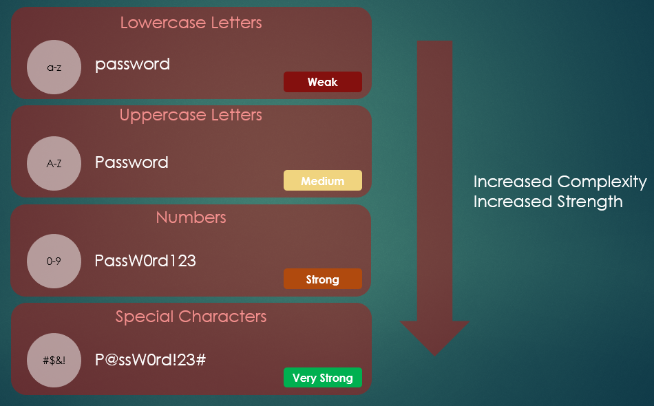

Title: How to Protect Your Digital Life
Date: 2025-10-22
Category: security
Tags: password,password

## Are Your Passwords as Strong as You Think? How to Protect Your Digital Life

*A quick note: This article was originally written as an assignment for a college course and has been updated and adapted for my website.*

---

In an era of ever-evolving cyber threats, robust password practices and trustworthy password managers are crucial for protecting both personal and corporate data. While new technologies like biometrics and passkeys are on the rise, passwords remain a ubiquitous part of our daily online lives, making their security a top priority.

### The Reality of Password Habits

Recent statistics from various cybersecurity sources paint a concerning picture of password security. Consider these facts:

*   A staggering **84% of users admit to reusing passwords** across multiple sites.
*   Globally, **only about 34% of people use a password manager** to keep their accounts secure.
*   At work, the situation isn't much better, with **only 25% of users worldwide being required to use a password manager**.
*   Worryingly, **41.7% of employees have shared their workplace passwords**, with many sharing them with family members or friends.

These numbers highlight a critical vulnerability in our collective online security. But what can we do to improve? The answer lies in creating strong passwords, eliminating password reuse, and utilizing password managers.

### The Building Blocks of a Strong Password

According to the Cybersecurity & Infrastructure Security Agency (CISA), three simple steps can significantly boost your password security:

1.  **Go for Length:** Aim for at least 16 characters or more.
2.  **Embrace Randomness:** Use a random mix of characters or a passphrase of 4-7 unrelated words.
3.  **Keep it Unique:** Use a different password for every single account.

The strength of a password can be measured by its "password entropy," which in simple terms, is how hard it is for someone to guess. The higher the entropy (measured in bits), the more secure the password. You can increase entropy by making your password longer and more complex.

While adding a mix of lowercase and uppercase letters, numbers, and special characters (like !@#$%) increases the pool of possible characters for a hacker to guess from, **randomness is key**. A password like `Password123!` is not as strong as it seems because it follows common patterns. As CISA warns, "Using an easy-to-guess password is like locking the door but leaving the key in the lock." Your passwords should ideally be random and not personally identifiable.

The third step is a fundamental rule of password hygiene: **don't reuse passwords**. If one account is compromised, using unique passwords for each of your other accounts prevents a domino effect of security breaches. But how can you possibly remember a unique, 16+ character password for every online account? That’s where password managers come in.

### Password Managers: Your Digital Vault

Storing all your passwords in one place might sound counterintuitive, but the technology behind password managers makes it a secure and efficient solution.

Here’s how they work:

*   **Encrypted Vault:** All your passwords are stored in a heavily encrypted vault.
*   **Master Password:** This vault is locked with a single, strong master password. Without it, accessing the stored information is nearly impossible.

Modern password managers also come with a suite of features to enhance your security:

*   **Password Generation:** They can create strong, random passwords for you, which you don't have to remember.
*   **Health Monitoring:** They can assess the strength of your existing passwords, identify reused passwords, and even alert you if your credentials have been exposed in a data breach.

### The Future is Passwordless: Exploring Alternatives

While password managers help us cope with passwords, the ultimate goal for the tech industry is to eliminate them entirely. Several exciting and more secure alternatives are becoming increasingly common.

#### Passkeys
Passkeys are quickly replacing passwords on major platforms. Instead of a password you create, a passkey uses a unique cryptographic key pair. A private key is stored securely on your device (like your phone or computer), and a public key is stored on the website's server. To log in, you simply authenticate on your device using your fingerprint, face, or PIN. This method is resistant to phishing and much easier for users.

#### Hardware Keys and Tokens
For an even higher level of security, many people use hardware authentication.
*   **Physical Security Keys (e.g., YubiKey):** These are small devices that you plug into your computer's USB port or tap on your phone (using NFC). When you log in, you must physically touch the key to approve the login, proving that you are present. This method is a form of Multi-Factor Authentication (MFA).
*   **Smart Cards (e.g., CACs):** Common Access Cards (CACs) are used extensively by the military and other government agencies. They are a type of smart card that contains a chip with the user's credentials and requires a card reader and a PIN to authenticate.
*   **Authentication Tokens:** These can be hardware fobs that generate a rotating code every 30-60 seconds or software-based authenticators on your phone. You enter the code along with your password to prove your identity.

These methods provide robust protection against remote attacks and are becoming the standard for securing sensitive accounts.

### Final Thoughts

In today's digital world, safeguarding our data is non-negotiable. While strong password habits are a great start, the future of digital security lies in passwordless solutions. By embracing technologies like passkeys and hardware tokens and using a password manager for any remaining password-based accounts, we can create a much safer online experience for everyone.

---

### **Sources**

Cybersecurity & Infrastructure Security Agency. (n.d.). *Use strong passwords*. U.S. Department of Homeland Security. Retrieved from https://www.cisa.gov/secure-our-world/use-strong-passwords

Cruz, B., & Turner, G. (2025). *The best password managers of 2025*. Security.org. Retrieved from https://www.security.org/password-manager/

Smith, D. A. (2022, October 27). *Top 15 password management best practices*. BeyondTrust. Retrieved from https://www.beyondtrust.com/blog/entry/top-15-password-management-best-practices
